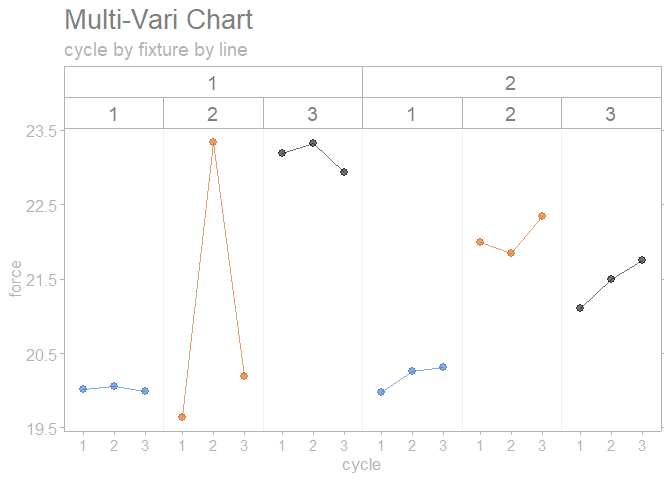

<!-- README.md is generated from README.Rmd. Please edit that file -->

# sherlock

<!-- badges: start -->
<!-- badges: end -->

The **{sherlock} R package** provides powerful graphical displays and
statistical tools to aid structured problem solving and diagnosis. The
functions of the package are especially useful for applying the process
of elimination as a problem diagnosis technique. **{sherlock}** was
designed to seamlessly work with the `tidyverse` set of packages.

*“That is to say, nature’s laws are causal; they reveal themselves by
comparison and difference, and they operate at every multi-variate
space-time point” - Edward Tufte*

## Installation

You can install the development version of `sherlock` from
[GitHub](https://github.com/) with:

``` r
# install.packages("devtools")
devtools::install_github("gaborszabo11/sherlock")
```

## Functions

While the package is currently under development, quite a few functions
are already available and ready to be used. Available functions are as
follows:

#### Plotting functions

`draw_multivari_plot()`

`draw_grouped_scatterplot()`

`draw_youden_plot()`

`draw_small_multiples`

`draw_cartesian_small_multiples()`

`draw_polar_small_multiples()`

`draw_interaction_plot()`

`draw_process_behavior_chart()`

`draw_timeseries_scatterplot()`

#### Helper functions

`load_file()`

`save_analysis()`

`normalize_observations()`

`theme_sherlock()`

`scale_color_sherlock()`

`scale_fill_sherlock()`

`draw_horizontal_reference_line()`

`draw_vertical_referencew_line()`

## Examples

Here are a few examples:

``` r
# Loading libraries
library(sherlock)
library(ggh4x)
#> Loading required package: ggplot2
```

``` r
multi_vari_data %>% 
  draw_multivari_plot(response = force, factor_1 = cycle, factor_2 = fixture, factor_3 = line)
```



``` r
library(sherlock)
library(ggh4x)

multi_vari_data_2 %>% 
  draw_multivari_plot(response = Length, factor_1 = Part, factor_2 = Operator, plot_means = TRUE)
```


``` r
polar_small_multiples_data %>% 
  draw_polar_small_multiples(angular_axis   = ID_Measurement_Angle, 
                             x_y_coord_axis = ID_2, 
                             grouping_var   = Tip_Bottom, 
                             faceting_var_1 = Mold_Cavity_Number,
                             point_size     = 0.5, 
                             connect_with_lines = TRUE)
```


``` r
library(sherlock)
library(dplyr)
#> 
#> Attaching package: 'dplyr'
#> The following objects are masked from 'package:stats':
#> 
#>     filter, lag
#> The following objects are masked from 'package:base':
#> 
#>     intersect, setdiff, setequal, union
library(ggh4x)

polar_small_multiples_data %>% 
  filter(ID_Measurement_Angle %in% c(0, 45, 90, 135)) %>% 
  normalize_observations(response = ID, grouping_var = Tip_Bottom, ref_values = c(0.2075, 0.2225)) %>% 
  draw_multivari_plot(response    = ID_normalized, 
                      factor_1    = ID_Measurement_Angle, 
                      factor_2    = Mold_Cavity_Number, 
                      factor_3    = Tip_Bottom, 
                      x_axis_text = "small") +
  draw_horizontal_reference_line(reference_line = 0)
#> Joining, by = "Tip_Bottom"
```


``` r
youden_plot_data_2 %>% 
  draw_youden_plot(x_axis_var = gage_1, y_axis_var = gage_2, median_line = TRUE, 
                   x_axis_label = "Gage 1", y_axis_label = "Gage 2")
#> Smoothing formula not specified. Using: y ~ x
```


``` r
youden_plot_data %>% 
  draw_youden_plot(x_axis_var = measurement_1, y_axis_var = measurement_2, 
                   grouping_var = location, x_axis_label = "Trial 1", y_axis_label = "Trial 2")
```


``` r
timeseries_scatterplot_data %>%
  draw_timeseries_scatterplot(y_var = y, grouping_var_1 = date, grouping_var_2 = cavity, faceting = TRUE, 
                              limits = TRUE, alpha = 0.15, interactive = FALSE)
#> Joining, by = c("date", "cavity")
#> Warning: Removed 6 rows containing missing values (geom_point).
```


## References

Diagnosing Performance and Reliability, David Hartshorne and The New
Science of Fixing Things, 2019

Statistical Engineering - An Algorithm for Reducing Variation in
Manufacturing Processes, Stefan H. Steiner and Jock MacKay, 2005
