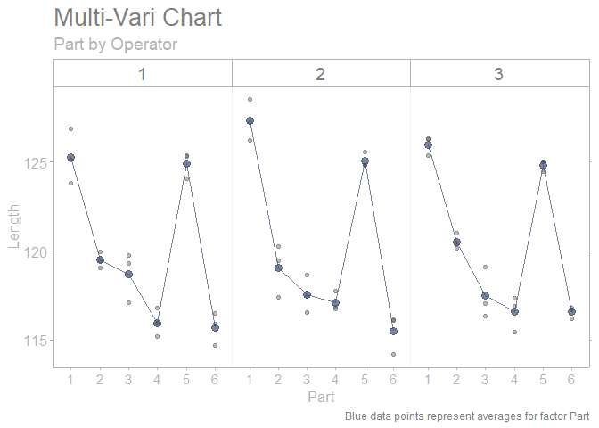

<!-- README.md is generated from README.Rmd. Please edit that file -->

# sherlock

<!-- badges: start -->
<!-- badges: end -->

The **{sherlock} R package** provides powerful graphical displays and
statistical tools to aid structured problem solving and diagnosis. It is
designed to seamlessly work with the `tidyverse` set of packages.

*“That is to say, nature’s laws are causal; they reveal themselves by
comparison and difference, and they operate at every multi-variate
space-time point” - Edward Tufte*

## Installation

You can install the development version of sherlock from
[GitHub](https://github.com/) with:

``` r
# install.packages("devtools")
devtools::install_github("gaborszabo11/sherlock")
```

## Functions

While the package is currently under development, a few functions are
already available and ready to be used. Available functions are as
follows:

#### Plotting functions

`draw_multi_vari_plot()`

`draw_cartesian_small_multiples()`

`draw_polar_small_multiples()`

`draw_youden_plot()`

#### Helper functions

`normalize_observations()`

`theme_sherlock()`

`scale_color_sherlock()`

## Examples

Here are a few examples:

``` r
library(sherlock)
library(ggh4x)
#> Warning: package 'ggh4x' was built under R version 4.1.3
#> Loading required package: ggplot2

multi_vari_data %>% 
  draw_multi_vari_plot(response = force, factor_1 = cycle, factor_2 = fixture, factor_3 = line)
```


``` r
library(sherlock)
library(ggh4x)

multi_vari_data_2 %>% 
  draw_multi_vari_plot(response = Length, factor_1 = Part, factor_2 = Operator, plot_means = TRUE)
```



``` r
youden_plot_data_2 %>% 
  draw_youden_plot(x_axis_var = gage_1, y_axis_var = gage_2, median_line = TRUE, 
                   x_axis_label = "Gage 1", y_axis_label = "Gage 2")
#> Warning in .recacheSubclasses(def@className, def, env): undefined subclass
#> "packedMatrix" of class "replValueSp"; definition not updated
#> Warning in .recacheSubclasses(def@className, def, env): undefined subclass
#> "packedMatrix" of class "mMatrix"; definition not updated
#> Smoothing formula not specified. Using: y ~ x
```


``` r
youden_plot_data %>% 
  draw_youden_plot(x_axis_var = measurement_1, y_axis_var = measurement_2, 
                   grouping_var = location, x_axis_label = "Trial 1", y_axis_label = "Trial 2")
```


## References

Diagnosing Performance and Reliability, David Hartshorne and The New
Science of Fixing Things, 2019

Statistical Engineering - An Algorithm for Reducing Variation in
Manufacturing Processes, Stefan H. Steiner and Jock MacKay, 2005
