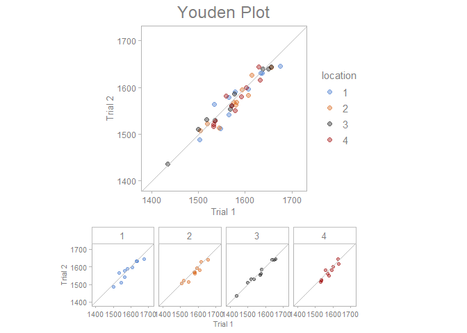

<!-- README.md is generated from README.Rmd. Please edit that file -->

# sherlock

<!-- badges: start -->
<!-- badges: end -->

The goal of {sherlock} is to provide powerful graphical displays and
statistical tools to aid Structured problem solving and diagnosis.

## Installation

You can install the development version of sherlock from
[GitHub](https://github.com/) with:

``` r
# install.packages("devtools")
devtools::install_github("gaborszabo11/sherlock")
```

## Examples

This is a basic example which shows you how to solve a common problem:

``` r
library(sherlock)
## basic example code
```

What is special about using `README.Rmd` instead of just `README.md`?
You can include R chunks like so:

``` r
youden_plot_data %>% 
  draw_youden_plot(x_axis_var = measurement_1, y_axis_var = measurement_2, grouping_var = location, x_axis_label = "Trial 1", y_axis_label = "Trial 2")
```



You’ll still need to render `README.Rmd` regularly, to keep `README.md`
up-to-date. `devtools::build_readme()` is handy for this. You could also
use GitHub Actions to re-render `README.Rmd` every time you push. An
example workflow can be found here:
<https://github.com/r-lib/actions/tree/v1/examples>.

You can also embed plots, for example:


In that case, don’t forget to commit and push the resulting figure
files, so they display on GitHub and CRAN.
