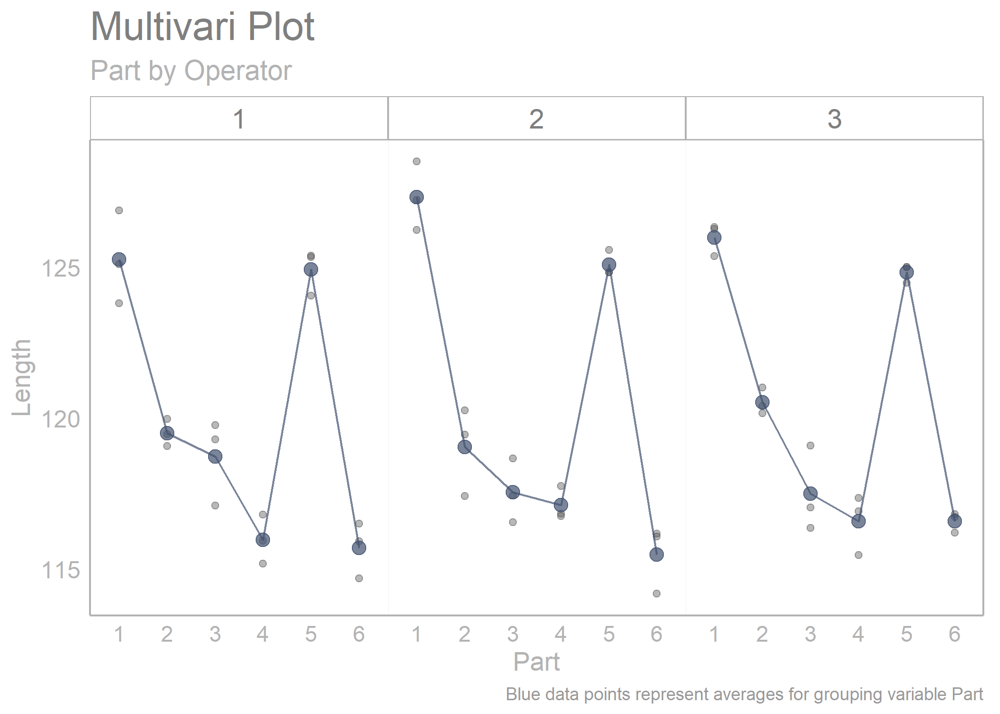
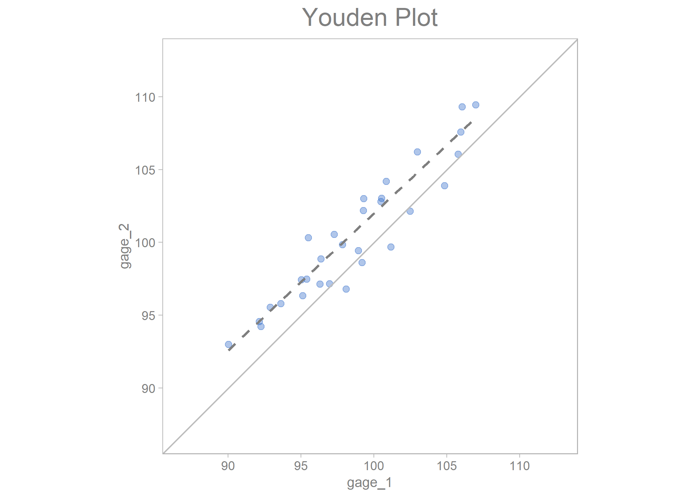

<!-- README.md is generated from README.Rmd. Please edit that file -->

# sherlock 

The **{sherlock} R package** provides powerful graphical displays and
statistical tools to aid structured problem solving and diagnosis. The
functions of the package are especially useful for applying the process
of elimination as a problem diagnosis technique. **{sherlock}** was
designed to seamlessly work with the `tidyverse` set of packages.

*“That is to say, nature’s laws are causal; they reveal themselves by
comparison and difference, and they operate at every multi-variate
space-time point” - Edward Tufte*

I would love to hear your feedback on `sherlock`. You can leave a note
on current issues, bugs and even request new features
[here](https://github.com/gaboraszabo/sherlock/issues).

`sherlock` 0.6.0 is already in the works. In addition to fixing a few
bugs and making enhancements to already-existing functionality, I will
be adding new plotting, statistical analysis and helper functions, such
as:

-   A new set of plotting functions and statistical tests called the
    Tukey-Duckworth test for problem diagnosis
-   `load_files()`, which is a function to read in and clean multiple
    files. Particularly useful when reading in multiple files having the
    same variables, for example reading in data from an experiment where
    data was logged and saved separately for each individual unit.
    Integration of a custom data cleaning function.
-   `create_project_folder`, which is a helper function to quickly
    create a project folder with a clever sub-folder structure for your
    project.

## Installation

`sherlock` is available on CRAN and can be installed by running the
below script:

``` r
install.packages("sherlock")
```

You can also install the development version of `sherlock` from
[GitHub](https://github.com/) with:

``` r
# install.packages("devtools")
devtools::install_github("gaborszabo11/sherlock")
```

## Functions

#### Plotting functions

`draw_multivari_plot()`

`draw_categorical_scatterplot()`

`draw_youden_plot()`

`draw_small_multiples_line_plot()`

`draw_cartesian_small_multiples()`

`draw_polar_small_multiples()`

`draw_interaction_plot()`

`draw_pareto_chart()`

`draw_process_behavior_chart()`

`draw_timeseries_scatterplot()`

#### Helper functions

`load_file()`

`save_analysis()`

`normalize_observations()`

`theme_sherlock()`

`scale_color_sherlock()`

`scale_fill_sherlock()`

`draw_horizontal_reference_line()`

`draw_vertical_reference_line()`

## Examples

Here are a few examples:

``` r
# Loading libraries
library(sherlock)
library(ggh4x)
#> Loading required package: ggplot2
#> Warning: package 'ggplot2' was built under R version 4.2.2
```

``` r
multi_vari_data %>% 
  draw_multivari_plot(response = force, 
                      factor_1 = cycle, 
                      factor_2 = fixture, 
                      factor_3 = line)
```


``` r
library(sherlock)
library(ggh4x)

multi_vari_data_2 %>% 
  draw_multivari_plot(response = Length, 
                      factor_1 = Part, 
                      factor_2 = Operator, plot_means = TRUE)
```



``` r
library(sherlock)
library(dplyr)
#> 
#> Attaching package: 'dplyr'
#> The following objects are masked from 'package:stats':
#> 
#>     filter, lag
#> The following objects are masked from 'package:base':
#> 
#>     intersect, setdiff, setequal, union

polar_small_multiples_data %>% 
  filter(Mold_Cavity_Number %in% c(4, 6)) %>% 
  rename(Radius = "ID_2") %>% 
  draw_polar_small_multiples(angular_axis   = ID_Measurement_Angle, 
                             x_y_coord_axis = Radius, 
                             grouping_var   = Tip_Bottom, 
                             faceting_var_1 = Mold_Cavity_Number,
                             point_size     = 0.5, 
                             connect_with_lines = TRUE, 
                             label_text_size = 7) +
  scale_y_continuous(limits = c(0.09, 0.115))
#> Scale for y is already present.
#> Adding another scale for y, which will replace the existing scale.
```


``` r
library(sherlock)
library(dplyr)
library(ggh4x)

polar_small_multiples_data %>% 
  filter(ID_Measurement_Angle %in% c(0, 45, 90, 135)) %>% 
  normalize_observations(response = ID, grouping_var = Tip_Bottom, ref_values = c(0.2075, 0.2225)) %>% 
  draw_multivari_plot(response    = ID_normalized, 
                      factor_1    = ID_Measurement_Angle, 
                      factor_2    = Mold_Cavity_Number, 
                      factor_3    = Tip_Bottom, 
                      x_axis_text = 6) +
  draw_horizontal_reference_line(reference_line = 0)
#> Joining, by = "Tip_Bottom"
```


``` r
youden_plot_data_2 %>% 
  draw_youden_plot(x_axis_var  = gage_1, 
                   y_axis_var  = gage_2, 
                   median_line = TRUE)
#> Smoothing formula not specified. Using: y ~ x
```



``` r
youden_plot_data %>% 
  draw_youden_plot(x_axis_var   = measurement_1, 
                   y_axis_var   = measurement_2, 
                   grouping_var = location, 
                   x_axis_label = "Trial 1", 
                   y_axis_label = "Trial 2")
```


``` r
timeseries_scatterplot_data %>%
  draw_timeseries_scatterplot(y_var = y, 
                              grouping_var_1 = date, 
                              grouping_var_2 = cavity, 
                              faceting       = TRUE, 
                              limits         = TRUE, 
                              alpha          = 0.15,
                              line_size      = 0.5, 
                              x_axis_text    = 7,
                              interactive    = FALSE)
#> Joining, by = c("date", "cavity")
#> Warning: Removed 6 rows containing missing values (`geom_point()`).
```


## References

Diagnosing Performance and Reliability, David Hartshorne and The New
Science of Fixing Things, 2019

Statistical Engineering - An Algorithm for Reducing Variation in
Manufacturing Processes, Stefan H. Steiner and Jock MacKay, 2005
